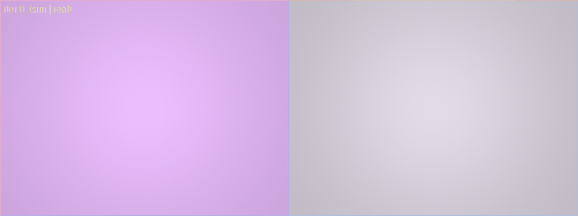

# SensorForge

Calibrate a simulated MuJoCo camera to match a real one, automatically. An
agent renders a scene through a physically-grounded ISP, compares it to a
reference frame, and proposes parameter updates until the two match, logging
every assumption it makes along the way.



*Left: uncalibrated sim. Right: target. The loop closes the color gap in a few
iterations.*

## What it is

A Python framework that:
1. Renders a scene through a configurable camera in MuJoCo (linear scene radiance).
2. Pushes it through a full ISP pipeline (optics, sensor noise, demosaic, color).
3. Compares the result to a reference (a real webcam, or a hidden sim preset).
4. Runs a LangGraph loop where an LLM (or a heuristic) tunes the ISP until
   SSIM / ΔE2000 fall within tolerance.
5. Produces a per-run report and a documented assumptions log.

## Quickstart

```bash
uv sync
uv run pytest          # or: make test
make demo              # reproducible calibration, no LLM or webcam needed
make dashboard         # browse runs in Streamlit
```

`make demo` runs in well under a minute on a laptop and needs no API keys, no
local model, and no camera.

## Results

Reproducible sim-as-real run (`make demo`, seed 0, uniform target, heuristic
proposer). The agent starts from uncalibrated ISP defaults and recovers a hidden
near-neutral camera look:

| Metric        | Uncalibrated | Calibrated |
|---------------|-------------:|-----------:|
| ΔE2000        |        16.62 |       1.43 |
| PSNR (dB)     |        21.67 |      43.02 |
| SSIM          |         0.99 |      0.995 |

Converged in 4 iterations (stop reason: within tolerance, target ΔE2000 < 3).
SSIM is near 1 on a flat field by construction; ΔE2000 is the meaningful color
metric here.

The EMVA-1288 estimators (temporal dark noise, photon-transfer system gain,
PRNU, DSNU) recover injected ground truth within 5%, verified by inject-and-
recover tests against a synthetic sensor.

### Proposer comparison

The same loop, same target and seed, driven by different proposers. This is the
point of the abstraction: capability is the lever, the infrastructure is fixed.

| Proposer          | Best ΔE2000 | Trajectory                       | Outcome              |
|-------------------|------------:|----------------------------------|----------------------|
| Heuristic         |        1.43 | 16.6 → 1.4                       | converged (4 iters)  |
| LLM, Llama 3.1 8B |       12.5  | 16.6 → 19.9 → 14.7 → 12.5, plateau | improved, then stalled |
| LLM, Llama 3.2 3B |       16.6  | 16.6 → 18.4, oscillated          | no improvement       |

The 3B model contradicted its own diagnosis and never improved. The 8B model
reasoned across iterations (it referenced past attempts and moved the right gain
in the right direction), cut the error by ~25%, then second-guessed itself and
plateaued. The deterministic heuristic converges every time. In every case the
loop clamped bad proposals, detected stalls, and preserved the best state with no
code change between runs. A frontier API model is the path to closing the gap
fully (`SENSORFORGE_LLM=anthropic`).

## How it works

- [docs/architecture.md](docs/architecture.md): components and data flow.
- [docs/isp_pipeline.md](docs/isp_pipeline.md): every ISP stage with its
  equation, units, and a citation.
- [docs/emva1288_subset.md](docs/emva1288_subset.md): which sensor metrics are
  implemented, how, and what is left out.
- [docs/adr/](docs/adr/): the decisions (MuJoCo, LangGraph, EMVA scope, ISP
  ordering, LLM adapter, tunable parameters).

## Running the real LLM loop

The demo uses a deterministic heuristic proposer so anyone can reproduce the
numbers without setup. The project's actual method is LLM-driven: swap in a
model and the loop is identical.

```bash
# Local default (needs Ollama running with llama3.2):
sensorforge calibrate --target uniform --real-source sim --max-iters 20

# Or a hosted model:
SENSORFORGE_LLM=anthropic sensorforge calibrate --real-source sim

# Against a real webcam:
sensorforge calibrate --real-source webcam --target uniform
```

The agent may tune only the six-knob color and exposure chain (exposure, black
level, white-balance gains, gamma); the scene light, full-well, noise, optics,
and CCM are fixed to keep the search well conditioned. See
[ADR 006](docs/adr/006-tunable-parameters.md).

## Limitations

See [LIMITATIONS.md](LIMITATIONS.md). Short version: single illuminant, uniform
target for v1, CCM and ColorChecker deferred, and the headline numbers use the
heuristic proposer (the LLM path needs a model).

## Development

```bash
make test        # pytest
make coverage    # enforce >80% on isp/ and metrics/
make lint        # ruff check + format check
```

Python 3.11, managed with `uv`. MIT licensed.
