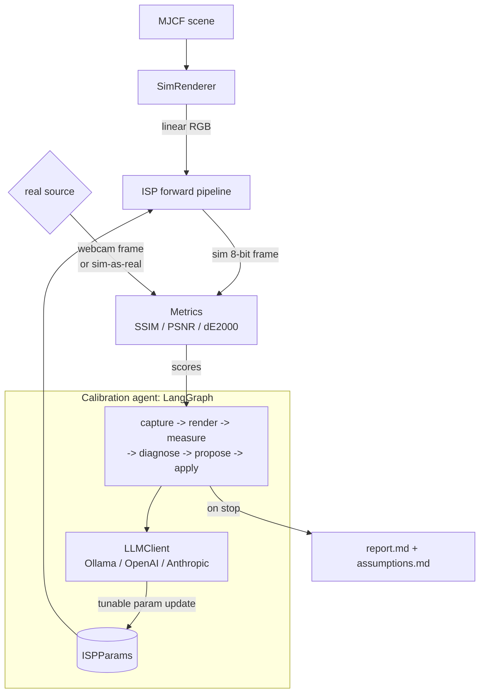

# Architecture

SensorForge has three subsystems feeding a calibration loop: a **simulator**
that renders a scene through a configurable camera, an **ISP** that turns that
render into a sensor-realistic frame, and a **metrics** layer that scores the
sim frame against a real one. An **agent** closes the loop, proposing ISP
parameter changes until the two match.

## Data flow

The **simulator** (`sim/`) loads an MJCF scene, exposes physical camera
intrinsics, and renders to float32 linear RGB in [0, 1], treated as scene
radiance (ADR 004). The **ISP** (`isp/`) pushes that radiance through optics,
sensor noise, and the digital color chain to a uint8 sRGB frame; every stage is
physically grounded and driven by a typed `ISPParams` object.

The **real source** is either a webcam capture (`capture/`) or, for a
reproducible run with no hardware, a sim render through hidden ground-truth
params. Either way the **metrics** layer (`metrics/`) compares sim against real
with SSIM, PSNR, and CIEDE2000, and characterizes the sensor with an EMVA-1288
subset.

The **agent** (`agent/`) runs a LangGraph state machine:
`capture -> render -> measure -> diagnose -> propose -> apply`, looping until
ΔE2000 falls within tolerance, the iteration budget is spent, or three rounds
pass with no improvement. An `LLMClient` adapter (Ollama by default, OpenAI or
Anthropic via env var) does the diagnosis and proposes new values for the six
tunable parameters; proposals are validated and clamped to physical bounds
before they touch the pipeline. To avoid a degenerate search, only the color
and exposure chain is tunable (exposure, black level, white-balance gains,
gamma); the scene light, full-well capacity, noise, optics, and CCM are fixed
(ADR 006). Each accepted change is logged to `runs/<timestamp>/assumptions.md`,
and the run ends with a markdown report.
